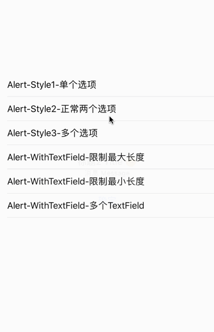

# Y_ShowAlert
对 UIAlertController 的扩展，快速创建与展示 AlertController

## 功能
快速创建与展示 AlertController，包括含有 TextField 的 Alert

使用 Observer 监听了添加的 TextField ，方便做输入内容 最大、最小长度的限制，以及确认按钮的 enabled 状态等

## 使用

* 普通的 Alert
```objc
NSArray *actionTitle = @[@"确认",@"取消"];
UIAlertController *alert = [UIAlertController alertWithTitle:@"标题 Title 🙃" message:@"消息 Message " actionsTitleArr:actionTitle alertAction:^(NSInteger actionIdx, UIAlertController *alertController) {

}];
[alert showAlert];
```

* 带有 TextField 的 Alert
```objc
NSArray *actionTitle = @[@"确认",@"取消"];
UIAlertController *alert = [UIAlertController alertWithTitle:@"标题 Title 🙃" message:@"消息 Message " actionsTitleArr:actionTitle alertAction:^(NSInteger actionIdx, UIAlertController *alertController) {

}];

[alert addTextFieldWithConfiguration:^(UITextField *textFieldConf) {

} observerTextFieldChanged:^(UITextField *textFieldObserver) {
        
}];

[alert showAlert];
```

## Example

详细使用参见Example
